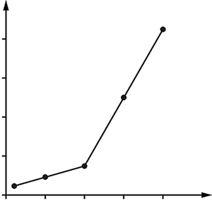
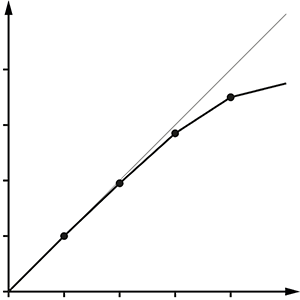
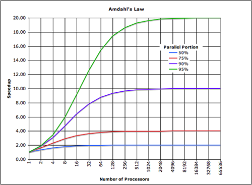
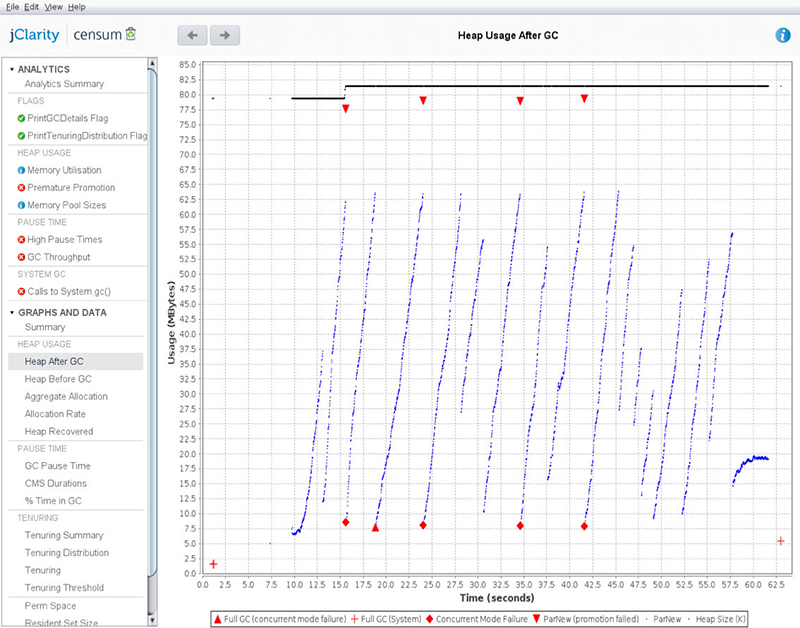
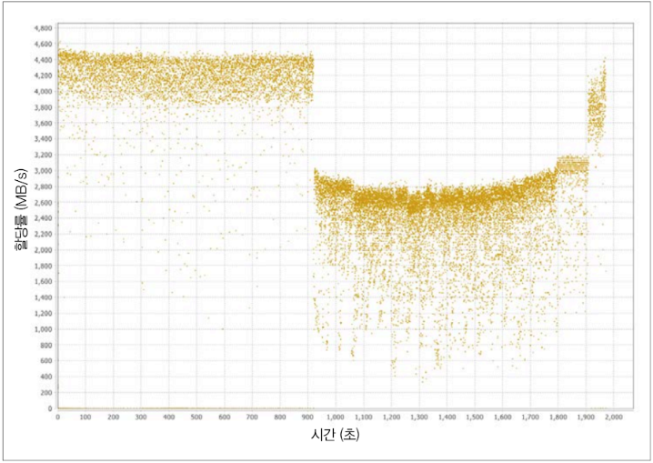

# Chapter 1 성능과 최적화

## 1.1 자바 성능: 잘못된 방법

- 자바 초장기에는 메서드 디스패치 성능이 최악이어서, 메서드를 잘게 나누지 말고, 큰 덩치의 메소를 작성하는게 좋다고 권고하기도 했다.
- 이 책은 성능 향상을 위해 여러 방면으로 살펴보자 한다.
  - 전체 소프트웨어 생명주기의 성능 방법론 (원문 : Methodology and performance testing within the overall software lifecycle)
  - 성능과 연된 테스트 이론
  - 측정, 통계, 툴링tooling (도구선정)
  - (시스템 + 데이터) 분석 스킬
  - 하부 기술과 메커니즘 (장치, 수단) (원문 : Underlying technology and mechanisms)
- 휴리스틱과 코드수준의 최적화 기법은 책의 끝부분에서 소개합니다. (원문 : we will introduce some heuristics and code-level techni-ques for optimization,)
- 모든 최적화 기법에는 함정과 트레이드오프trade-off가 있으니 주의해야 한다.
- 일반적인 원칙은 이렇습니다. (원문 : In general, there are no:)
  - JVM을 더 빨리 작동시키는 '마법의 스위치'는 없다.
  - 자바를 더 빨리 실행하게 만드는 팁과 트릭은 없다.
  - 숨겨져 있는 '비밀 알고리즘'은 없다.
 
## 1.2 자바 성능 개요

- 관리되는 서브시스템managed subsystem은 실용성을 추구하는 자바의 대표적인 성격이다.
- 관리되는 서브시스템이란 개발자가 용량을 일일이 관리하는 부담을 덜고, 저수준으로 제어하는 기능을 일부 포기하는 것이다.
- JVM 전반에 걸쳐 등장하는 관리되는 서브시스템은 그 존재 자체로 JVM 애플리케이션 런타임 동작에 복작도complexity를 유발한다.
- JVM 애플리케이션의 성능 측정값을 정규 분포를 따르지 않으므로, 기초 통계 기법만 가지고는 제대로 측정할 수 없다. 측정값을 샘플링하면 특이점을 일으킨 가장 중요한 이벤트가 묻혀버릴 가능성이 크다.
- 측정하는 행위 자체도 오버헤드를 일으킨다.

## 1.3 성능은 실험과학이다

- '성능'은 다음과 같은 활동을 하면서 원하는 결가를 얻기위한 일종의 실험과학이다.
  - 원하는 결과를 정의한다.
  - 기존 시스템을 측정한다.
  - 요건을 충족시키려면 무슨 일을 해야 할지 정한다.
  - 개선 활동을 추진한다.
  - 다시 테스트한다.
  - 목표가 달성되었는지 판단한다.
- 성능 분석은 통계치에 근거해 적절히 결과를 처리하는 활동이다.

## 1.4 성능 분류

- 성능 지표는 성능 분석의 어휘집vocabulary이자, 프로젝트의 목표를 정량적인 단위로 표현한 기준이다.
- 다음은 가장 일반적인 기본 성능 지표이다.
  - 처리율
  - 지연
  - 용량
  - 사용률
  - 효율
  - 확장성
  - 저하
- 대다수의 프로젝트에서 이 모든 지표가 동시에 최적화 되는 경우는 없다.

### 1.4.1 처리율

- 처리율Throughput은 (서브)시스템이 수행 가능한 작업 비율을 나타내는 지표이다.
- 보통 일정 시간 동안 완료한 작업 단위 수로 표시한다. (예: 초당 처리 가능한 트랜잭션 수)
- 의미 있는 지표가 되려면 플랫폼 정보도 기술해야 한다. (예: 하드웨어 스펙, OS, 테스트 시스템의 종류 등)
- 트랜잭션은 테스트 할 때마다 동일해야 한다.
- 처리율을 테스트할 떄 실행 간 워크로드workload 역시 일정하게 유지해야 한다.

### 1.4.2 지연

- 1초에 100리터를 흘려보내는 수도관의 처리율은 1초에 처리되는 부피이다. 이 때 지연latency은 수도관 자체의 길이에 해당한다.
- 즉, 하나의 트랜잭션을 처리하는데 걸리는 시간을 의미한다.
- 지연을 종단 시간이고도 하며, 대개 그래프에서 워크로드에 비례하는 함수로 표시한다.

### 1.4.3 용량

- 용량capacity은 시스템이 동시 처리 가능한 작업 단위(트랜잭션) 개수를 말한다.
- 용량은 처리율과 밀접한 연관이 있다.
 
 
 
 ### 1.4.4 사용률
 
- 사용률utilisation은 워크로드에 따라서 리소스 별로 큰 차이를 보인다.
- 성능 분석 업무 중 가낭 흔한 태스트는 시스템 리소스를 효율적으로 활용하는 것이다.

### 1.4.5 효율
 
 - 전체 시스템의 효율efficiency은 처리율을 리소스 사용률로 나눈 값으로 측정한다.
 - 대형 시스템에서는 원가 회계 형태로 효율을 측정하기도 한다.
 
 
 ### 1.4.6 확장성
 
 - 리소스 추가에 따른 처리율 변화는 시스템/애플리케이션의 확장성scalability을 가늠하는 척도이다.
 - 클러스터를 2배 확장했을 때, 트랜잭션 처리량이 2배 늘었다면 '완벽한 선형 확장'을 달성했다고 한다.
 - 현실적으로는 선형 확장을 달성하기 매우 어렵다.
 
 
 ### 1.4.7 저하
 
 - 시스템이 풀 가동된 상태에서 처리율이 늘어나지 않고 지연이 증가하는 현상을 저하degradation라고 한다.
 
 
 ### 1.4.8 측정값 사이의 연관 관계
 
 - 측정값들은 어떤 식으로든 서로 연결 되어 있다.
 - 시스템 사용률이 적은 시간에 부하가 늘어도 사용률이 눈에 띄게 증가하지 않지만, 부하가 걸린 상태에서는 부하가 조금만 늘어도 다른 측정값이 크게 변할 수 있다.
 - 부하는 늘었는데 리소스가 그대로라면 저하되는 성능 측정값(이 경우 지연)이 있을 것이다.
 
 ## 1.5 성능 그래프 읽기
 
 - 부하가 증가하면서 예기치 않게 저하(여기서는 지연)가 발생한 그래프이다. 이런 형태를 *성능 엘보*performance elbow라고 한다.
 
 

 [그림 1-1 성능 엘보]
 
 
 - [그림 1-2]는 클러스터에 장비를 추가함에 따라 거의 선형적을 처리율이 확장되는, 아주 운이 좋은 케이스이다. 이러한 경우는 환경이 극단적으로 순조로울 떄나 가능하다.
 
 
 
 [그림 1-2 준-선형적near-linear 확장]
 
 - [그림 1-3]은 태스크를 처리할 때 프로세서 개수를 늘려도 실행 속도를 최대 어느 정도까지 높일 수 있는지를 나태는 그래프이다.
 - 워크로드에 순차 실행 작업 조각이 하나라도 있으면 선형 확장은 처음부터 불가능하며, 한계점 또한 뚜렷하다.
 - 순차 실행 비율이 5%인 알고리즘도 12배 시간을 단축하려면 32개의 프로세서가 필요하다.
 
 
 
 [그림 1-3 암달의 법칙]
 
 - 부하가 별로 없는 애플리케이션에서도 JVM 가비지 컬렉터 서브시스템의 메모리 사용 패턴은 [그림 1-4]처럼 '톱니' 모양을 나타낸다.
 
 
 
 [그림 1-4 건강한 메모리 사용 현황]
 
 
 - [그림 1-5]는 피보나치 수열을 계산하는 애플리케이션을 실행하여 얻은 그래프로, 메모리 할당률 성능 튜닝할 때 아주 중요한 메모리 그래프이다.
 - 90초 부근에서 갑자기 할당률이 급격히 떨어지고 있다. 이 지점에서 심각한 가비지 컬렉터 문제가 발생했고, 가비지 컬렉터 쓰레드들이 서로 CPU 경합을 벌여 메모리를 충분히 할당받지 못 한 상태이다.
 
 
 
 [그림 1-5 문제가 있는 할당률 분포]
 
 - [그림 1-6]은 시스템 리소스 누수가 있을 때 흔히 나타나는 징후이다. 부하가 증가하면면 지표(여기서는 지연)가 차츰 악화되다가 결국 시스템 성능이 급락하는 *변곡점*inflection point에 이르게 된다.
 
 
 
 
 [그림 1-6 부하가 높을 때 상당한 지연 발생]
