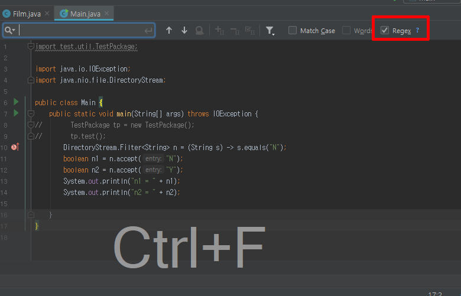
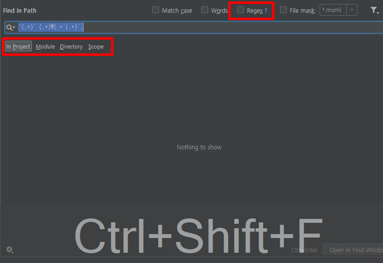
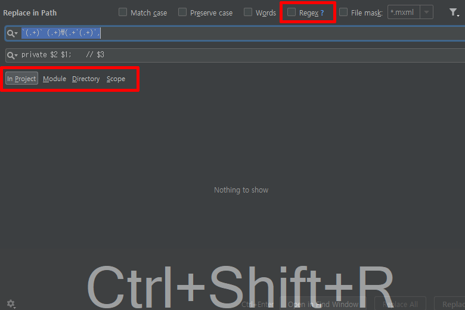

# IntelliJ 정규식을 이용해 코딩 살림 보태기

## 서문
정규식을 이용하면 단순한 반복 코딩작업이나 원하는 값을 찾을 때 매우 유용하게 사용할 수 있습니다.
몇 가지 예를 들면 아래와 같은 일들을 할 수 있습니다.

- DB 스키마를 바로 Java 모델로 변환하기
- 디버그 모드의 객체 확인 창의 값을 복사하여 바로 JUnit 테스트 검증용 객체 만들기
- 소스코드에서 원하는 항목만 검색하기
- 원하는 문자열만 뽑아와서 코드 생성하기

직접 변환하는 과정을 통해 정규식을 배워보도록 하겠습니다.

## 정규식

정규식은 아래와 같이 정의하고 있습니다.

> “정규 표현식(regular expression, regexp, regex, rational expression) 또는 정규식은 특정한 규칙을 가진 문자열의 집합을 표현하는 데 사용하는 형식 언어이다.”

정규식의 표준은 아래와 같이 2가지로 크게 나눌 수 있습니다.

    POSIX (Basic 과 Extended로 나뉨)
    Perl 방식의 PCRE

정규식은 표준이 있긴 하지만, 프로그래밍 언어와 IDE 등에서 미묘하게 다른 문법을 채택하고 있기 때문에, 다른 곳에서 사용하던 정규식을 가져다 쓸 때에는 반드시 테스트를 해야 합니다. 
오늘 이 글에서 알아볼 정규식은 IntelliJ 에서 지원하는 정규식 문법을 사용하게 됩니다. IntelliJ 에서만 지원하는 문법들이 있음을 유의하시기 바랍니다.

### 정규식의 간단한 문법 알아보기

정규식에는 아래와 같이 많은 패턴들이 있습니다.

| 정규식 패턴들 |
| --- |
| [ ] . * + {m, n} \| ^ $ ? \ ( ) (x) (?:x) x(?=y) x(?!y) x|y {n} [xyz] [^xyz] ...... (많음) |

이 많은 패턴들을 다 알면 좋겠지만, 자주 쓰이는 패턴 5개만 우선 짚고 넘어가겠습니다.
| 입문용 패턴 |
| --- |
| . * + \| ( ) |

정규식은 패턴에 일치하는 문자열들을 Match 되었다고 표현합니다. 아래 표를 통해 간단하게 의미를 알아보겠습니다.
|   | 패턴 | 설명 | 패턴 예 | 문자열 예 | Match 결과 |
|---|---|---|---|---|---|
| 1 | . (점 1개) | 임의의 문자 1개를 의미 | .. | abc | ab |
| 2 | * | 단독으로 사용할 수 없으며, 바로 앞의 패턴이 0개 이상 반복됨을 의미 | .* | abcdef ghij | abcdef ghij |
| 3 | +	| 단독으로 사용할 수 없으며, 바로 앞의 패턴이 1개 이상 반복됨을 의미 | .+ | abcdef ghij | abcdef  ghij
| 4 |() | 뽑아내고 싶은 문자열을 하나의 단위로 묶을 때 사용하며, 묶인 값은 변수로 치환 된다 | (apple) | grapeapplemelon | apple (이 값은 $1에 저장되어 사용할 수 있음) |
| 5 | \||	OR 연산으로 단독으로 사용 불가능하고, ( )와 함께 사용 | (a\|b)| acd | a |

이해가 안 되는 부분은 실습을 통해 좀 더 배워보도록 하겠습니다.

## IntelliJ IDEA의 정규식 사용

우선 IntelliJ 에서는 정규식을 사용 가능한 곳을 확인해야 합니다. 크게 4가지를 꼽을 수 있습니다. 아래 스크린 샷을 통해 간단히 확인 하시면 됩니다.

|   |  정규식 사용 가능 메뉴 |
|---|---|
| 1 |  |
| 2 |  |
| 3 |  |
| 4 |  |

## JUnit 검증용 데이터 만들기

